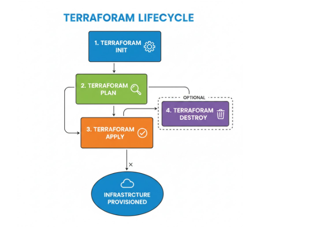

# 05-terraform

Terraform is an open-source infrastructure as a code tool.

## Key Features

- **Infrastructure as Code**: Define and manage infrastructure using declarative configuration files
- **Multi-Cloud Support**: Works with AWS, Azure, GCP, and many other providers
- **State Management**: Tracks infrastructure state to detect changes and plan updates
- **Plan and Apply**: Preview changes before applying them to avoid surprises
- **Modular**: Use modules to organize and reuse infrastructure code
- **Version Control**: Configuration files can be versioned with Git

## How It Works

1. **Write Configuration**: Define infrastructure in `.tf` files using HCL (HashiCorp Configuration Language)
2. **Initialize**: Run `terraform init` to download providers and modules
3. **Plan**: Run `terraform plan` to see what changes will be made
4. **Apply**: Run `terraform apply` to create or update infrastructure
5. **Destroy**: Run `terraform destroy` to remove infrastructure

## Benefits

- **Consistency**: Ensure infrastructure is deployed the same way every time
- **Scalability**: Manage complex, large-scale infrastructure
- **Collaboration**: Team members can work on infrastructure code together
- **Automation**: Integrate with CI/CD pipelines for automated deployments
- **Cost Optimization**: Track and manage cloud resources efficiently

## Install Terraform on RHEL/CentOS

```bash
sudo yum install -y yum-utils
sudo yum-config-manager --add-repo https://rpm.releases.hashicorp.com/RHEL/hashicorp.repo
sudo yum -y install terraform
terraform --version
```

## Install the Azure CLI on Linux

- Import the Microsoft repository key (for RHEL 10 and CentOS Stream 10):
  ```bash
  sudo rpm --import https://packages.microsoft.com/keys/microsoft-2025.asc
  ```

- Add the packages-microsoft-com-prod repository (for RHEL 10):
  ```bash
  sudo dnf install -y https://packages.microsoft.com/config/rhel/10/packages-microsoft-prod.rpm
  ```

- Install Azure CLI:
  ```bash
  sudo dnf install azure-cli
  ```

- **Login to Azure CLI**:
  ```bash
  az login
  ```
  This command authenticates you with Azure and allows Terraform to manage Azure resources on behalf.

For more information, see: https://learn.microsoft.com/en-us/cli/azure/install-azure-cli-linux?view=azure-cli-latest&pivots=dnf


## Terraform Lifecycle



The Terraform lifecycle consists of several phases that ensure safe and predictable infrastructure management:

### Phases:

1. **Write Configuration**
   - Create `.tf` files defining your infrastructure
   - Use HCL (HashiCorp Configuration Language)
   - Define resources, variables, and outputs

2. **Initialize (terraform init)**
   - Download required providers and modules
   - Initialize the working directory
   - Set up the backend for state storage

3. **Plan (terraform plan)**
   - Analyze configuration and current state
   - Show what changes will be made
   - Preview additions, modifications, and deletions
   - Safe to run multiple times

4. **Apply (terraform apply)**
   - Execute the planned changes
   - Create, update, or destroy resources
   - Update the state file
   - Confirm changes before proceeding

5. **Destroy (terraform destroy) - Optional**
   - Remove all resources defined in configuration
   - Clean up infrastructure
   - Use with caution

### Lifecycle Diagram

```
Write Config (.tf files)
        ↓
   terraform init
        ↓
   terraform plan
        ↓
   terraform apply
        ↓
Infrastructure Created/Updated
        ↓
   terraform destroy (optional)
        ↓
Infrastructure Removed
```

### Best Practices

- Always run `terraform plan` before `apply`
- Use version control for `.tf` files
- Store state files securely (remote backend recommended)
- Use modules for reusable components
- Test changes in development environments first 

